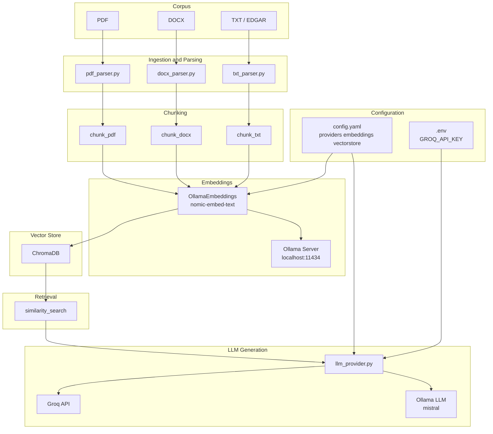

# 🏗️ Architecture — Agent RAG (Multi‑Modèles)

Ce document décrit l’architecture technique actuelle du projet : ingestion documentaire (PDF/DOCX/TXT), chunking, embeddings, indexation vectorielle, retrieval, et couche d’abstraction LLM.

## Composants

### 1) Configuration

- `config.yaml`
  - `providers.*` : configuration LLM (Groq / Ollama / OpenAI / Gemini)
  - `embeddings.*` : configuration embeddings (Ollama `nomic-embed-text`)
  - `vectorstore.*` : configuration base vectorielle (Chroma persistée)
- `.env` : clés API (ex: `GROQ_API_KEY`)

### 2) Ingestion & Parsing

- PDF : `agent/pdf_parser.py`
  - extraction texte par page
  - métadonnées : `page`, `title`, `section`
- DOCX : `agent/docx_parser.py`
  - extraction paragraphes + tables
  - métadonnées : `style`, `is_heading`, `section`
- TXT (EDGAR) : lecture brute + découpe en segments

### 3) Chunking (par section + overlap)

- `agent/chunking.py`
  - PDF : chunks regroupés par `section` (titres détectés) + overlap
  - DOCX : chunks regroupés par `section` (headings) + overlap
  - TXT : chunks par fenêtre glissante (max chars + overlap)

### 4) Embeddings

- `agent/vectorstore.py`
  - embeddings via `langchain_ollama.OllamaEmbeddings`
  - modèle recommandé : `nomic-embed-text`
  - timeout configuré via `config.yaml`

### 5) Indexation Vectorielle

- `agent/indexing.py` + `build_index.py`
  - vectorstore : Chroma persistée (`vectorstore/chroma`)
  - insertion par batch (`--batch-size`)
  - garde-fou gros fichiers (`--max-chunks-per-file`)

### 6) Retrieval (recherche)

- `test/test_retrieval.py`
  - `similarity_search(query, k=...)`
  - retourne les chunks les plus proches + métadonnées

### 7) Couche LLM multi‑modèles

- `agent/llm_provider.py`
  - `LLMProvider(provider=..., model=...)`
  - bascule Groq / Ollama via config sans changer le code métier

## Diagramme (Mermaid)



## Commandes de vérification (venv)

```powershell
.\venv\Scripts\python.exe test_pdf_parser.py
.\venv\Scripts\python.exe test_docx_parser.py
.\venv\Scripts\python.exe test_chunking.py
.\venv\Scripts\python.exe build_index.py --reset --data-dir data/raw/EDGAR --limit-files 1 --max-chars 800 --overlap-chars 80 --batch-size 4 --max-chunks-per-file 40
.\venv\Scripts\python.exe test\test_retrieval.py
```

